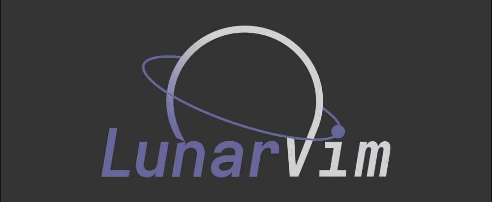
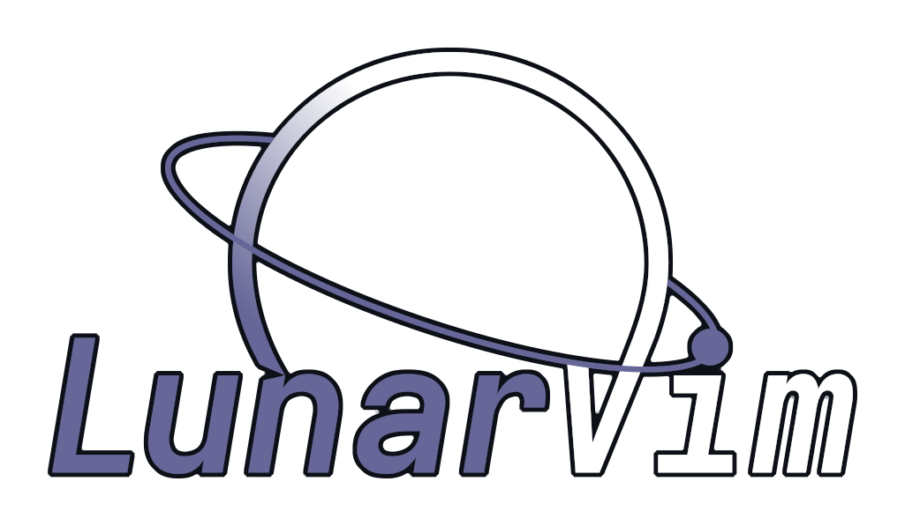

 

    
    
    <a href="https://github.com/lunarvim/LunarVim/blob/main/LICENSE">
      
    
    

 

## [LunarVim](https://github.com/LunarVim/LunarVim)

> <https://www.lunarvim.org/>

An IDE layer for Neovim with sane defaults which works OOTB(out-of-the-box). Completely free and community driven.

## LunarVim Goals

1. Provide basic functionalities required from an IDE
    - LSP
    - Formatting/Linting
    - Debugging
    - Treesitter
    - Colorschemes
2. Be as fast and lean as possible
    - Lazy loading
    - Not a single extra plugin
    - User configurable lang/feature enable/disable
3. Provide a [simple and easy](https://github.com/LunarVim/LunarVimCommunity) way for users to share their own configuration or use others.
4. Hot reload of configurations
    - Hot install of lsp/treesitter/formatter required upon openning a filetype for the first time
5. Provide a stable & maintainable error free configuration layer over neovim
    - With the help of the community behind it
    - Github workflow testing
    - Freezing plugin versions
6. Provide detailed documentation
    - Video series on how to configure LunarVim as an IDE for each lang
7. Valhalla

## TODO

- [x] add some common library or plugin path to lsp runtime path by `lvim.lang.lua.lsp.setup`
- [x] sudo file: set $EDITOR env-var and `sudo -e filename`
- [ ] move all uncommon plugins' mappings to buffer-mappings by condition or `ftplugin` or `ftdetect`
- [ ] understand 
- [ ] lsp for save without formatting(:h :autoformat :formatting) 
- [ ] use lua-dev 
- [ ] refactor plugins' configuration in `user` fold, perhaps using `require` to generate `lvim.plugins`
- [ ] <C-w> for zoom, modes.nvim, filetype.nvim, better-escape, startup-time
- [ ] auto-session
- [ ] entire object: vae vie
- [ ] go to next/previous symbols like vscode's editor.action.wordHighlight.next
- [ ] lua require('focus').focus_toggle()
- [ ] update `lunarvim` and show difference
- [ ] add keymappings to convert between floating-window
- [ ] use [feat: add trim_newlines formatter](https://github.com/jose-elias-alvarez/null-ls.nvim/commit/f9ca1200102655b21d0d6cc7648917e054d3e123)
- [ ]  [Workspace search and replace](https://github.com/nvim-telescope/telescope.nvim/issues/875)
- [ ]  [Search and replace across multiply files](https://github.com/nvim-lua/wishlist/issues/18)
- [ ]  [Code coverage in editor](https://github.com/nvim-lua/wishlist/issues/31)
- [ ]  [Edit git commit and git rebase -i inside neovim](https://github.com/nvim-lua/wishlist/issues/29)
- [ ] diff unsaved file with saved file like vscode
- [ ] plugin: open word under cursor with `devdocs` in browser
- [ ] `q` for quit: tsplayground
- [ ] self mode for moving bufferline by `<` and `>`

